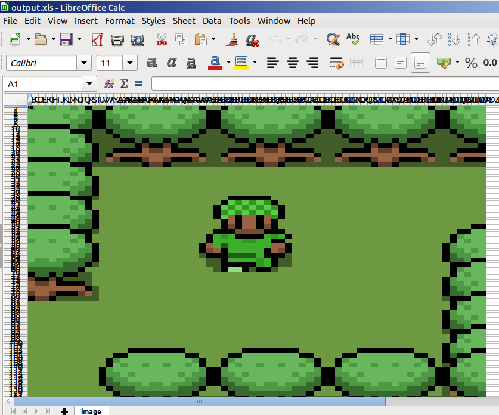

## Pixel spreadsheet

Simple script to convert an RGB image to an excel spreadsheet.

### How to run

`./image2excel.py <input image>`

After running the script it will create an `output.xls` file which will contain the spreadsheet image.

### Example

**Input image**

**Output spreadsheet screeshot**

## original repo:
[https://github.com/takacs/pixel-spreadsheet](https://github.com/takacs/pixel-spreadsheet)
